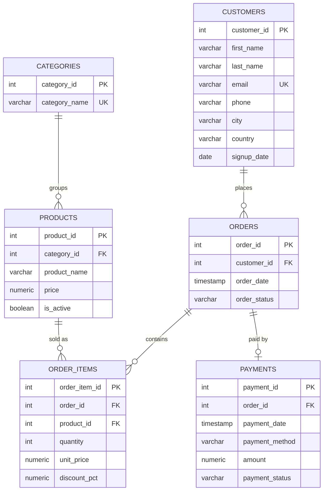
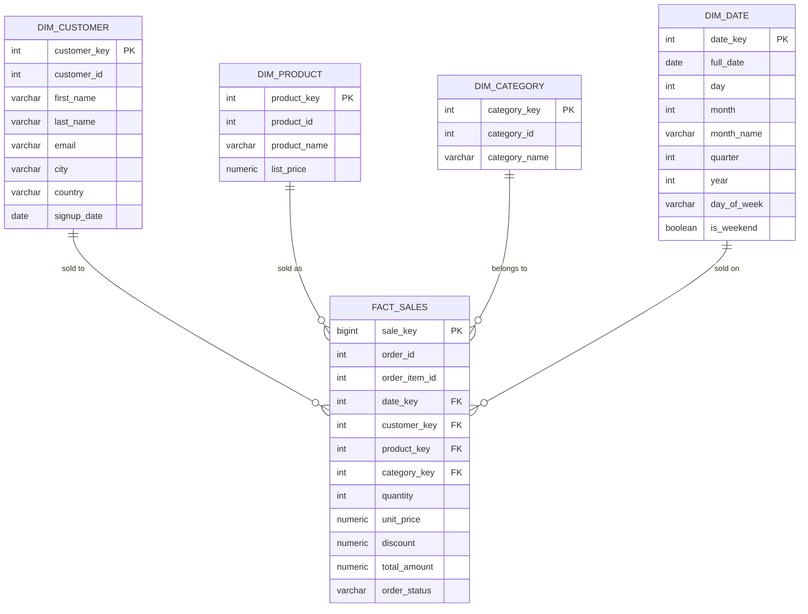

# Data Model

## 1. OLTP (Transaction Database) — Entity Relationship Diagram

Normalized (3NF) relational model. Every fact is stored exactly once;
derived values (line totals, order totals) are computed, not stored.

**Why this shape:**
- `order_items` is the classic bridge table for the many-to-many relationship
  between orders and products, and it is also where quantity/price/discount
  actually belong (they describe a *line*, not an order or a product).
- `unit_price` is copied onto `order_items` at time of sale intentionally —
  this is **not** duplication, it's historical accuracy. `products.price`
  can change over time; the price a customer actually paid must not.
- `payments` is kept separate from `orders` (1:1 in this simple model) so
  that payment-specific attributes (method, status, payment date) don't
  pollute the order entity, and so the model could later support partial /
  multiple payments per order without changing `orders`.

---

## 2. Data Warehouse — Star Schema

**Grain of `fact_sales`:** one row per product line within one order
(i.e. one row per `order_items` row in the OLTP database). This is the
lowest useful grain for this business — it lets every report roll up
(by date, by product, by customer, by month) without losing information,
while staying cheap to query since there's no finer-grained event to model.

**Why a star schema, and why these dimensions:**
- **Surrogate keys** (`*_key`, auto-incrementing) decouple the warehouse
  from OLTP IDs. The OLTP `customer_id` etc. is kept alongside as the
  natural key, mainly so the ETL can look rows up idempotently.
- **`dim_category` is separate from `dim_product`** (rather than
  denormalizing category name onto the product dimension) because the
  project explicitly reports on category performance, and a dedicated
  category dimension keeps that rollup a simple join instead of a
  string-based `GROUP BY`.
- **`dim_date`** is a standard warehouse pattern: turning `order_date`
  into a lookup table gives cheap, pre-computed calendar attributes
  (month name, quarter, weekend flag) without repeating date arithmetic
  in every report query.
- **Degenerate dimensions** (`order_id`, `order_item_id`) are kept directly
  on the fact table rather than in their own dimension tables, since they
  have no descriptive attributes of their own beyond identifying the row —
  standard practice for order/line identifiers in a star schema.
- **Measures** (`quantity`, `unit_price`, `discount`, `total_amount`) are
  additive across every dimension except `discount` (a rate), which is why
  `total_amount` is stored pre-computed rather than recalculated in every
  report query.
